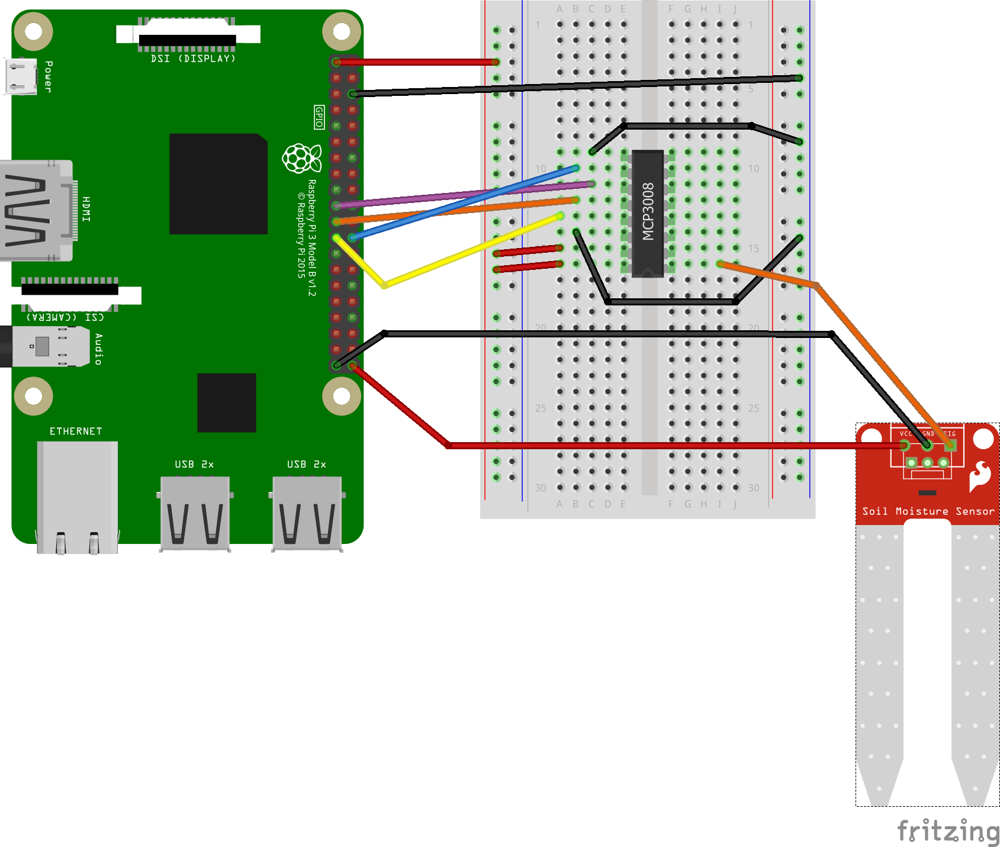

## Schematic

## Relay

To be able to switch 12V for the water pump a relay is required. As probably multiple pumps can be switched with one raspberry pi an array of relais is nice.

#### Source:
https://www.amazon.de/gp/product/B01C2IN2U2

The Friting part for the relay array was found here:
https://timgolisch.wordpress.com/2015/09/12/fritzing-4-channel-relay-part/?lipi=urn%3Ali%3Apage%3Ad_flagship3_pulse_read%3B2EoG3NlRQeOhHCM617M3XA%3D%3D

## Water pump

#### Source:
https://www.amazon.de/gp/product/B01I9BN3CI