# Add self-signed certificates to your browser or mac

For chrome, firefox and mac we provide instructions

## Chrome

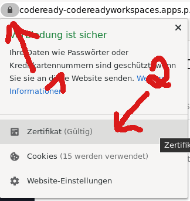

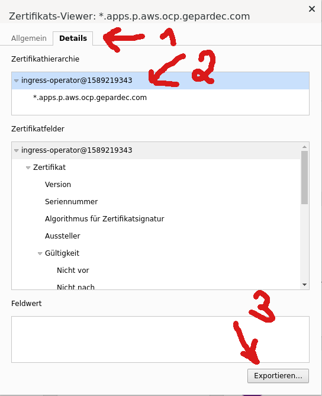

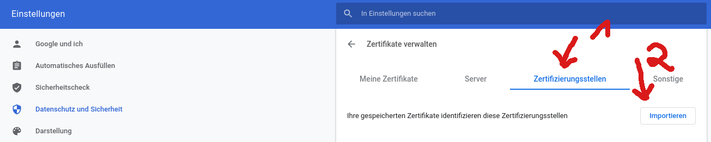

## Firefox

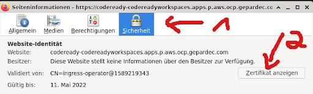

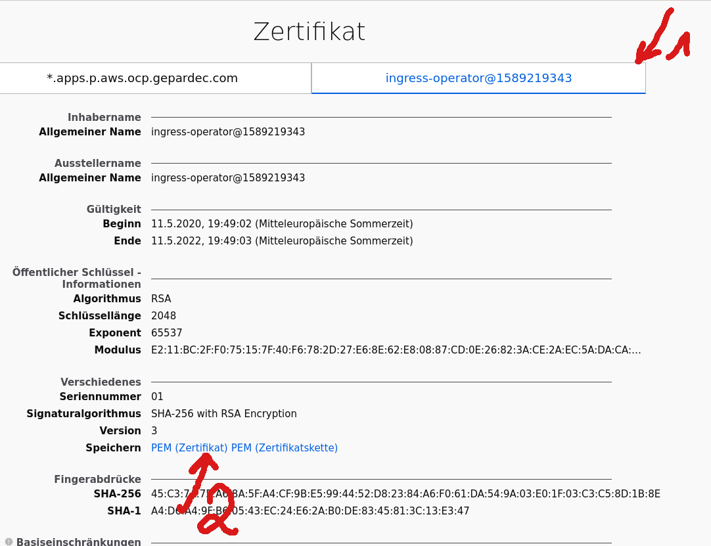

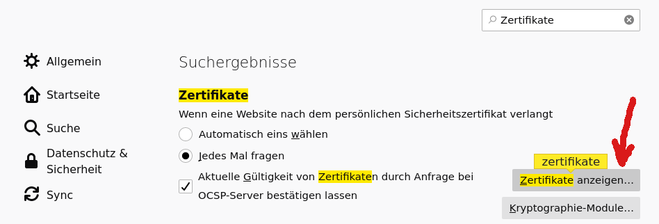

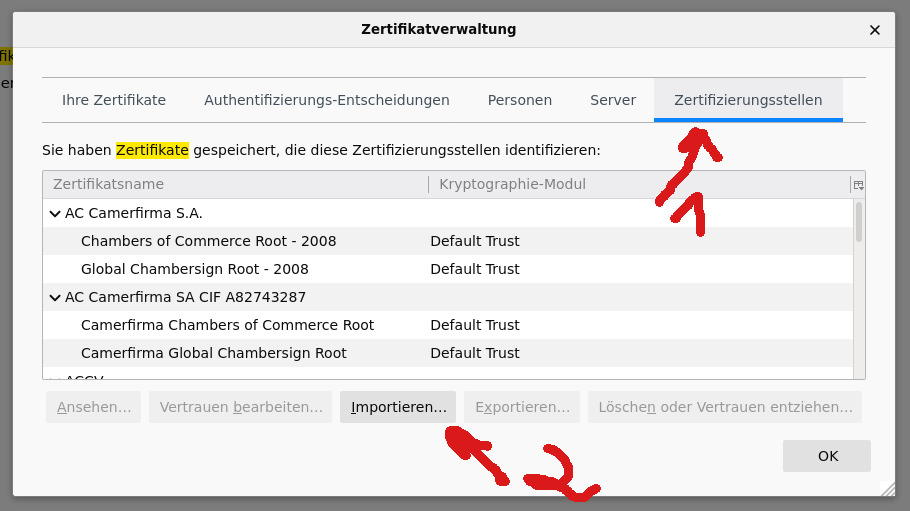

## MAC

On Mac we have to import the certificate (ingress-operator-...) into the KeyChain Access application. The you have to
trust the certificate with “Informationen->Vertrauen->Immer Vertrauen”. In detail:

In the browser you click on the "Not Save" (“Nicht Sicher”) symbol.

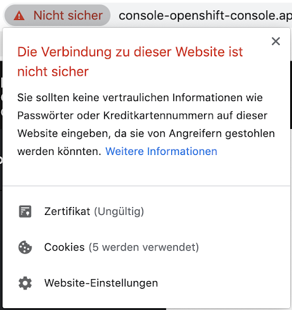

Choose the link “Zertifikat (Ungültig)” You see the certificate chain:

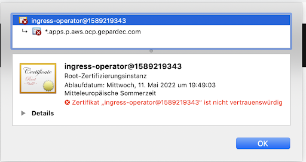

Choose the top certificate, the one for the ingress-operator. Drag the picture with the certificate picture onto the
desktop. Open the certificate file with the KeyChain Access application:

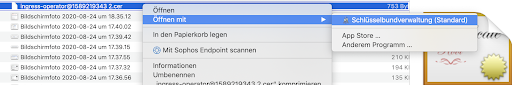

In the KeyChain Access application search for the ingress certificate and select it.

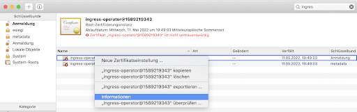

With a right-click select "Information" to get certificate details:

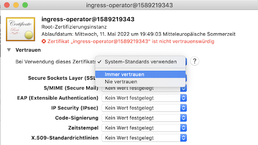

Trust the certificate by choosing “Immer Vertrauen”
