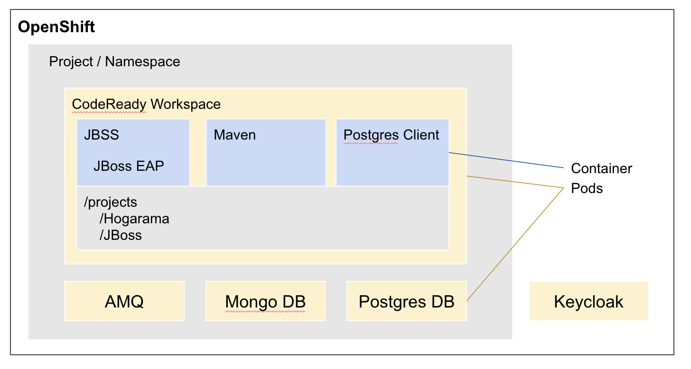
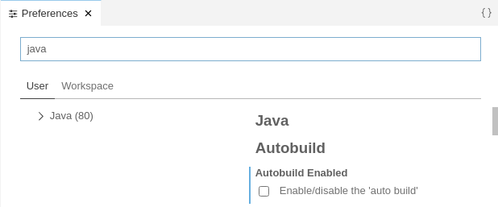
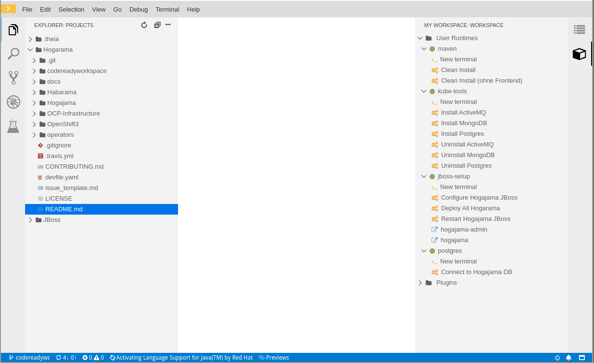
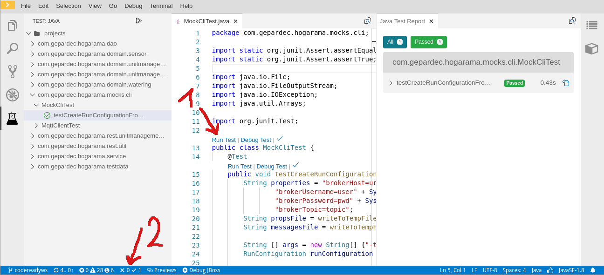
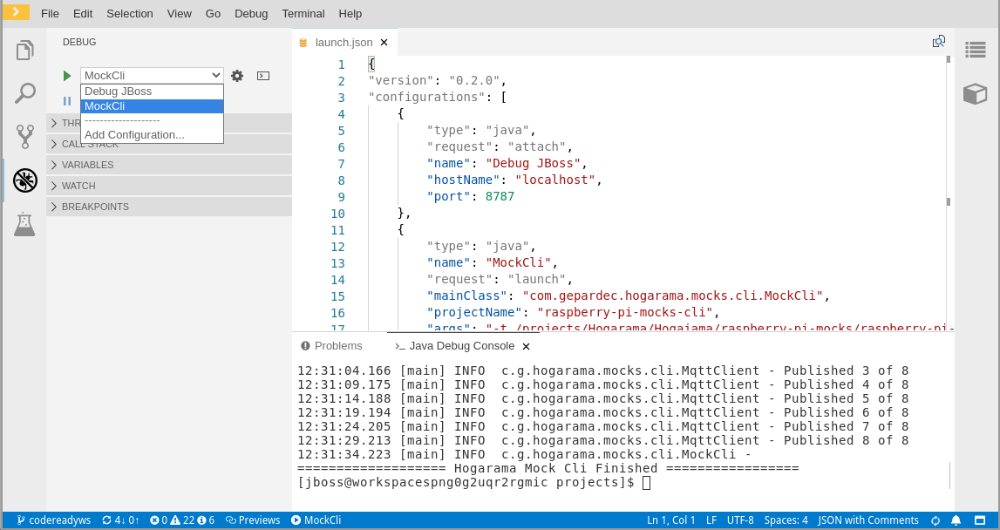
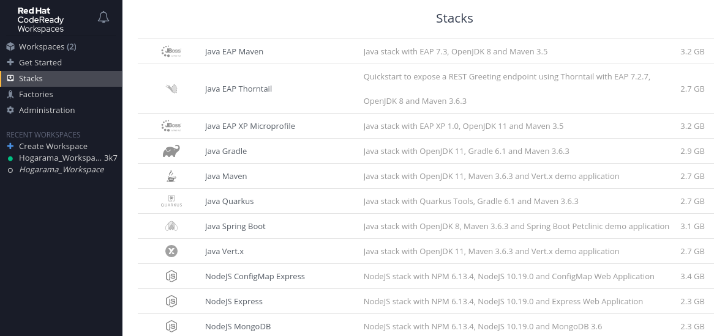

# Setup with CodeReady Workspaces

[CodeReady Workspaces](https://developers.redhat.com/products/codeready-workspaces/overview) is a browser based
development environment in OpenShift. This page describes how to use CodeReady Workspaces for developing Hogarama.

From now on lets call CodeReady Workspaces CRW.

## Overview



All componentes, except Keycloak, run in one project/namespace for the user. The utility components for Hogarama (AMQ,
Mongo, Postgres) run in their own pods. The CRW also has one pod. The CRW components run in containers within that pod.
JBoss will be started within a JBSS container within the CRW pod. Further tools like maven also have their own
container. Project sources are mounted under /projects into these containers.

## Development in CRW

You can create a workspace
with [one click](https://codeready-codereadyworkspaces.apps.p.aws.ocp.gepardec.com/f?url=https://github.com/Gepardec/Hogarama/tree/codereadyws)  
Each user can have multiple workspaces but only one running.

### First time additional steps

If it is the first time you create a workspace, additional steps are necessary.

#### Trust self-signed certificates

Because we use self-signed certificates you need to trust them.  
Please follow the instructions provided
in [CodeReady-Workspaces-self-signed-certificates](CodeReady-Workspaces-self-signed-certificates).

#### Generate SSH Keypair for Github

The first time you will get an error that the repository for hogarama cannot be cloned.  
That's because the location in the devfile is defined as `git@github.com:Gepardec/Hogarama.git`.  
Press F1 and type `SSH: generate key pair` view the public key and add it your github account.  
Restart the workspace: Open the navigation bar (top left corner) -> Workspaces -> click on the workspace -> Stop
button (top right corner) -> Open button -> wait.  
Now the repository should be cloned.

#### Activate Java Language Support

The java language support is not active by default. It activates when you open a java file.  
At the bottom you should see it gets activated.


This has to be done after every start of the workspace.

#### Disable Java Autobuild

Java autobuild is interfering with the maven build. To disable it open the preferences (shortcut `ctrl+,`) and search
for java.



You can trigger a build with the shortcut `shift + alt + b` (the language support for java must be activated for the
shortcut to work).

### Develop Hogajama

Now you should be able to contribute code and see the following view.



On the right side in the view `My Workspace` predefined commands are available

#### maven: clean install

Builds the Hogajama project

#### kube-tools: Install/Uninstall ActiveMQ, MongoDB and Postgres

Install or uninstall the components with helm into the same openshift project.  
Important: They keep running after the workspace stops.

#### jbss-setup: Configure Hogajama JBoss

Configures a JBoss with the scripts located in `Hogarama/Hogajama/configuration/local_configuration` and environment
variables from `Hogarama/codereadyworkspace/hogarama_dev.env`  
This command keeps running and shows the jboss logs.

#### jbss-setup: Deploy all Hogarama

Deploys all war files with `jbss deploy`.

#### jbss-setup: Restart Hogajama JBoss

If you change something in `Hogarama/codereadyworkspace/hogarama_dev.env` or continue working use this command to start
or restart the JBoss.  
Like `Configure Hogajama JBoss` this command keeps running and shows the JBoss logs.

#### jbss-setup: hogajama / hogajama-admin

Opens the application in your browser.

#### postgres: Connect to Hogajama DB

Opens a terminal and connects with psql to the postgres host/user/password defined in
`Hogarama/codereadyworkspace/hogarama_dev.env`  
For example show the tables with `\d`

### Executing Tests

You can execute tests from within the test class (1) or use the plugin view on the left side.  
Display a test report page by opening it over the bottom toolbar (2).



### Launch Configurations

Use the debug view to use or add launch configurations.  
For example you can connect the debugger with the JBoss or execute a main class.



## Extend the workspace

The [devfile](https://github.com/Gepardec/Hogarama/blob/codereadyws/devfile.yaml) describes our workspace and can easily
be extended.  
Use the
official [documentation](https://access.redhat.com/documentation/en-us/red_hat_codeready_workspaces/2.3/html/end-user_guide/developer-workspaces_crw#making-a-workspace-portable-using-a-devfile_crw)
for more information.
As an example our devfile can be used or have a look at the provided stacks.



## CRW Installation and Administration

CRW is installed using an operator. We followed
the [official documentation from Red Hat](https://access.redhat.com/documentation/en-us/red_hat_codeready_workspaces/2.3/html/installation_guide/installing_codeready_workspaces_on_openshift_container_platform#installing-codeready-workspaces-using-the-codeready-workspaces-operator-in-openshift-4-web-console_crw).  
For further configuration we
used [Chapter 5. Advanced configuration options for the CodeReady Workspaces component](https://access.redhat.com/documentation/en-us/red_hat_codeready_workspaces/2.3/html/installation_guide/advanced-configuration-options-for-the-codeready-workspaces-server-component_crw).

You can find the current configuration from our CRW instance in
our [Hogarama Git Repository](https://raw.githubusercontent.com/Gepardec/Hogarama/codereadyws/codereadyworkspace/che-cluster.yaml).  
Because of the operator it is very easy to modify the CRW instance.  
Below find the parameters which we edited and why they were edited.

###### CHE_INFRA_KUBERNETES_WORKSPACE__SA__CLUSTER__ROLES: edit

CRW starts your workspace in a single pod with several containers in it. The default serviceaccount associated with the
pod is che-workspace.  
Because we have a container where we use helm to install some components, the serviceaccount che-workspace needs the
permissions to do that.  
With that parameter you can add roles to the serviceaccount. In our case the available clusterrole `edit`.

###### CHE_WORKSPACE_SIDECAR_IMAGE__PULL__POLICY: IfNotPresent

The containers in the workspace pod have imagePullPolicy defined as always, which is the default.  
Because it is not necessary to always download the images, when a workspace is starting, we defined `IfNotPresent`.

###### pluginRegistryImage: 'gepardec/che-plugin-registry:1.0.4'

There was no way to execute java unit tests directly within the IDE.  
The VS Code Extension [vscode-java-test](https://github.com/microsoft/vscode-java-test) adds that functionality but is
missing in CRW 2.3.  
We simply extended the plugin registry image, pushed it docker hub and reference it with the parameter
`pluginRegistryImage`.

**Dockerfile**

```
FROM registry.redhat.io/codeready-workspaces/pluginregistry-rhel8@sha256:e2f865550b46ead535c4b6cd8204889957e3bbc73300ad8af4e4e6a570249477
ADD https://github.com/microsoft/vscode-java-test/releases/download/0.22.3/vscjava.vscode-java-test-0.22.3.vsix /var/www/html/v3/resources/chepardec/
ADD meta.yaml /var/www/html/v3/plugins/redhat/java8/latest/meta.yaml
```

**meta.yaml**

```
apiVersion: v2
publisher: redhat
name: java8
version: latest
type: VS Code extension
displayName: Language Support for Java 8
title: Language Support for Java(TM) by Red Hat
description: Java Linting, Intellisense, formatting, refactoring, Maven/Gradle support
  and more...
icon: https://raw.githubusercontent.com/redhat-developer/codeready-workspaces/master/dependencies/che-plugin-registry/resources/images/default.svg?sanitize=true
repository: https://github.com/redhat-developer/vscode-java
category: Language
firstPublicationDate: '2020-07-22'
spec:
  containers:
    - image: "registry.redhat.io/codeready-workspaces/plugin-java8-rhel8@sha256:b6e36406e7f8ff86f462f370f55143446ceb0c555b86b13593436f5e71b7cab1" # tag: registry.redhat.io/codeready-workspaces/plugin-java8-rhel8:2.3
      name: vscode-java
      memoryLimit: 1500Mi
      args:
        - sh
        - -c
        - ${PLUGIN_REMOTE_ENDPOINT_EXECUTABLE}
      volumes:
        - mountPath: /home/theia/.m2
          name: m2
  extensions:
    - relative:extension/resources/download.jboss.org/jbosstools/vscode/3rdparty/vscode-java-debug/vscode-java-debug-0.26.0.vsix
    - relative:extension/resources/download.jboss.org/jbosstools/static/jdt.ls/stable/java-0.63.0-2222.vsix
    - relative:extension/resources/chepardec/vscjava.vscode-java-test-0.22.3.vsix
latestUpdateDate: "2020-08-12"
```

###### allowUserDefinedWorkspaceNamespaces: true

If you want to run your workspace in an existing openshift project you need to set this parameter to `true`

###### workspaceNamespaceDefault: chepardec-\<workspaceid>

If you do not define a namespace, the format of the new openshift project name is `chepardec-<workspaceid>`.  
