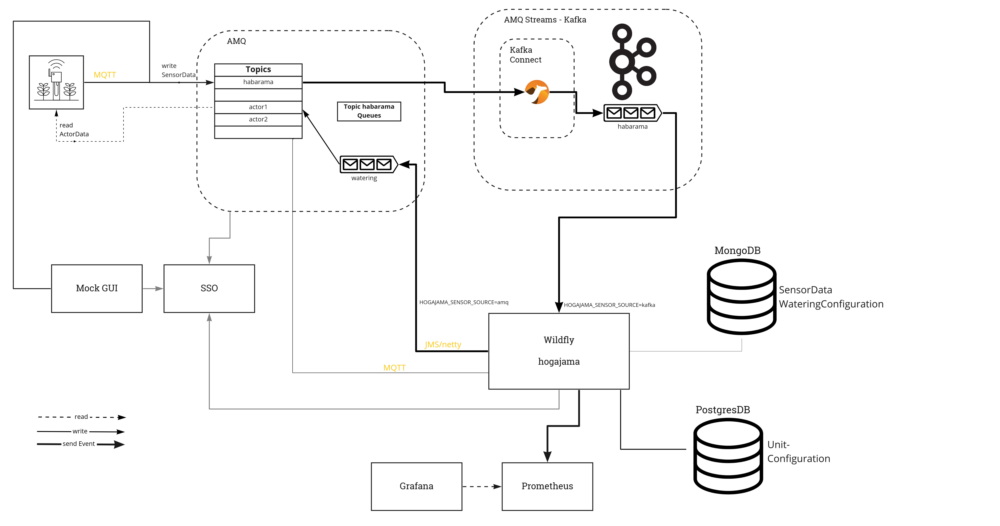

Welcome to the Hogarama wiki!

Hogarama is an internal project from [Gepardec](http://www.gepardec.com) to experiment with some technologies and
showcase [OpenShift](https://www.openshift.com).

One part runs in the [Cloud](https://github.com/Gepardec/Hogarama/wiki/Cloud-Components), the other is installed
on [Raspberry Pi](/Gepardec/Hogarama/wiki/Habarama).

## News

* 2023-02-24: In a series of Learning Friday Projects we work on simplifying local development with Hogarama.
* 2021-04-02: In a new Learnig Friday Project we integrate [Kafka](Kafka) into Hogarama.

## Demo

DEMO URL: https://app-hogarama.apps.steppe.gepaplexx.com/

## Architecture

Various sensors or actors can be connected to a Raspberry Pi client. The Raspberry Pis are connected with the cloud. The
cloud application runs on OpenShift. Users connect via browser to the cloud application.

The project consists of three main parts:

* Sensor network
* Cloud control server
* Client application

### Components

As of June 2021 we use the following components plus Keycloak as Single-Sign-On Server:

### Requirements

Hogarama should fulfill the following requirements:

1. The cloud app provides services for multiple tenants
2. The application is meant to be scalable. There should be no practical limit in the number of sensors or tenants
3. The data from the tenants should be separated or analysed together depending on privacy requirements.
